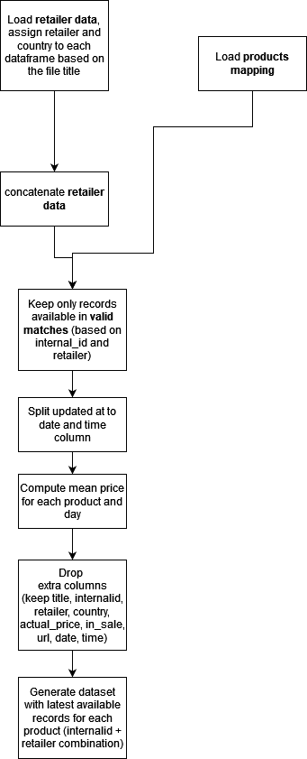

# Data Analyst practical task

## General info

Concatenate data from different sources ([heinemann](https://www.heinemann-shop.com/en/fra/) and [aelia](https://www.aeliadutyfree.cz/)), merge with product mapping, parse and output to csv. Generate dataset with latest record for each product.
- use python + pandas
- output 2 files 
  - output.csv (merged data available in products_mapping)
  - output_latest.csv (latest available data for each product from output.csv)
- Reuse code where possible

Clone this repository and send the main.py file or link to the github repository to tomas@forloop.ai

## File structure
heinemann_de.csv + aelia_cz.csv
- Chocolate data with the most important features - title, url + image links, price, sale flag, availability flag, record retrieval date

products_mapping.csv
- Connects similar products (internalid) from different retailers (retailer) to known internal characteristic of product (referenceEan, data not provided)